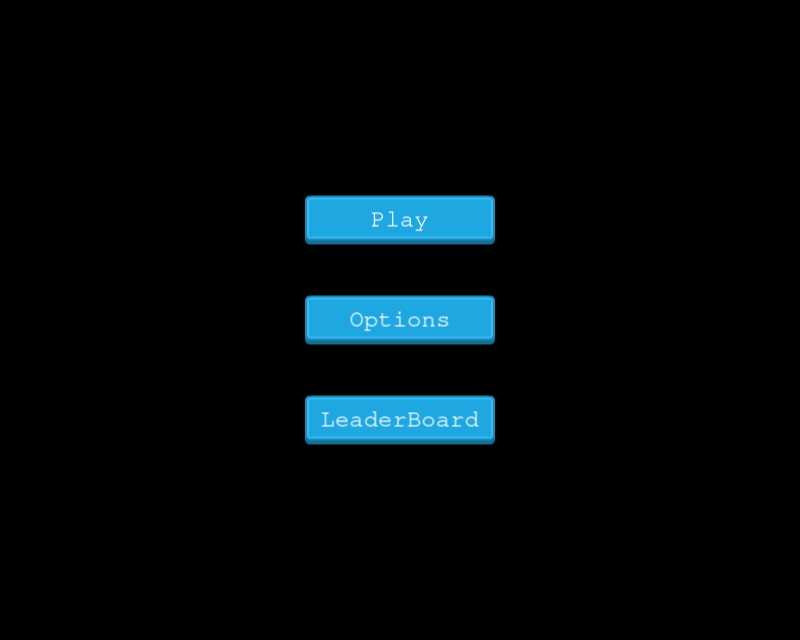
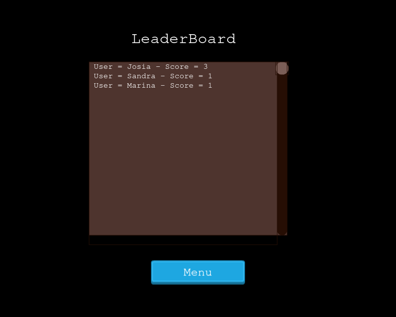
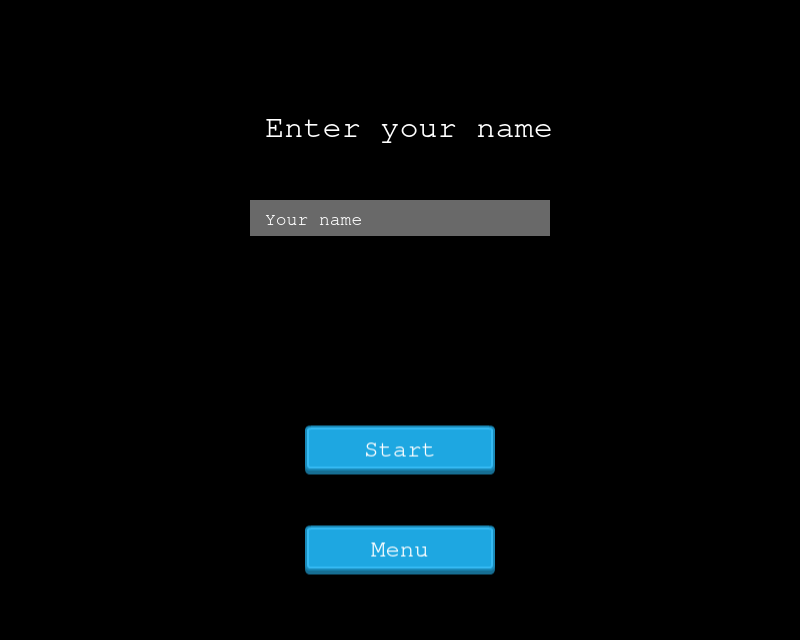

# Jet Pack Mouse
This project consists of building a video game using JavaScript (ES6) and the Phaser game engine.
## Game Design Document
This game is an infinite runner game based like Jetpack [jetpack joyride](https://fr.wikipedia.org/wiki/Jetpack_Joyride).
The goal is to keep our Jetpack-wearing mouse alive for as long as possible collecting coins and avoiding obstacles.
The score starts with 1 by default.

## How to play
* You can Switch on the jet pack and fly up with the up arrow key on your keyboard.
* Our hero can fly backwards by using the left arrow key on your keyboard.
* Our hero can increase his speed by using the right arrow key on your keyboard.
* Our hero can fly down by using the down arrow key on your keyboard.
* You can restart the game by pressing SPACE on your keyboard when the game is over.
* You can go to the menu by pressing ENTER on your keyboard when the game is over.

## Design Credits

* House Background art from Game Art Guppy.

* Rocket Mouse art from Game Art Guppy.

## Requirements

Node.js is required to install dependencies and run scripts via npm.
Usage

## Getting Started:

To get a local copy up and running follow these simple example steps:

1. Under the repository name, click the Clone or download green button.

2. Copy the URL given by clicking the clipboard button.

3. Open a terminal window in your local machine and change the current directory to the one you
   want the clone directory to be made.

4. Type  git clone and then paste the URL you previously copied to the clipboard.

5. Open a new terminal window in your local machine and change the current directory to your
   cloned directory.

6. Run `npm install` / `npm i` from the Terminal.

7. after that `npm run build` from the terminal.

8. Finally `npm start`.

## Testing

Run testing cases and Jest will print messages depending on the result

  $ npm run test

## See a live demo [Here](https://raw.githack.com/rindrajosia/tictactoe-js/feature/index.html)

## Show your support
Give a ⭐️ if you like this project!

# Screenshot

* Menu
* 

* Leaderboard
* 

* Player name
* 

## Authors

👤 **Rindra josia**

* Github: **[@rindrajosia](https://github.com/rindrajosia)**
* Twitter: **[@rindrajosia](https://twitter.com/josia_rindra)**
* Linkedin: **[linkedin](https://www.linkedin.com/in/rindra-josia-99b2111a2/)**

## 🤝 Contributing

Contributions, issues and feature requests are welcome!
